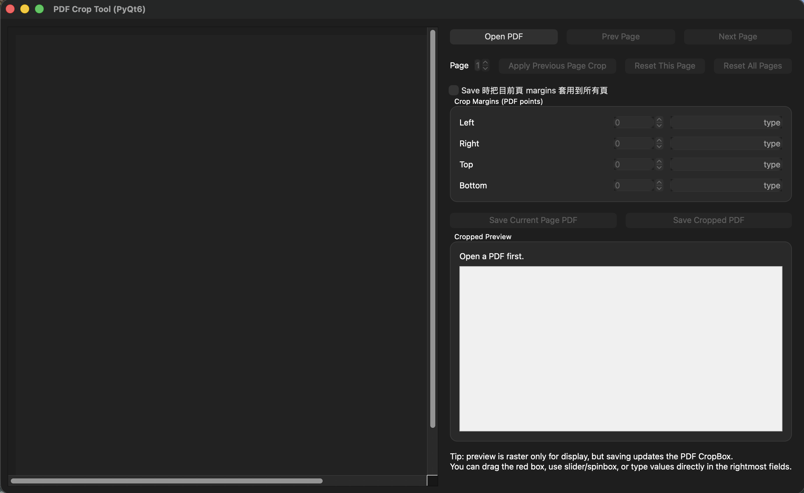

# PDF Crop Tool (PyQt6)

A lightweight desktop GUI for **cropping PDF page margins interactively** while keeping the output as **PDF**.

This tool is designed for workflows like:

- export a figure PDF from PowerPoint or plotting scripts
- manually trim extra whitespace
- keep the result in **PDF format**
- avoid the **PNG → PDF** detour when you want to preserve a vector-friendly workflow

> Preview is rendered as an image for display only.  
> The saved result is still a **cropped PDF**, not a PNG wrapped inside a PDF.

---

## Preview

### Main UI


### Drag the crop boundary


### Before / After
<p align="center">
  
  
</p>

---

## Why this tool?

A common paper-figure workflow looks like this:

```text
Matplotlib / PowerPoint → export PDF → realize there is too much whitespace → crop it
```

Many quick fixes convert the figure to **PNG**, crop it, and then save back to PDF.  
That works visually, but it turns the workflow into **raster-in-PDF**.

This tool keeps the workflow much cleaner:

```text
PDF → crop margins → save cropped PDF
```

---

## Features

- **PyQt6 desktop GUI**
- Open a **PDF** file
- Navigate pages with:
  - Previous / Next buttons
  - page number selector
- Crop margins from:
  - left
  - right
  - top
  - bottom
- Adjust crop values using:
  - direct drag on the preview
  - sliders
  - spin boxes
  - direct numeric text input
- **Apply Previous Page Crop** to reuse the last page’s settings
- Save:
  - current page only
  - full cropped PDF
- Optionally apply the current page’s crop to **all pages** on save

---

## Screenshots You Should Add

To make the GitHub page visually complete, add these images:

```text
docs/images/
├── main-ui.png
├── drag-crop.gif
├── before.png
└── after.png
```

Suggested content:

- `main-ui.png`  
  Full app window screenshot

- `drag-crop.gif`  
  Short animation showing the red crop boundary being dragged

- `before.png`  
  Original PDF page preview with excess whitespace

- `after.png`  
  Cropped result preview

---

## Installation

### Requirements

- Python 3.10+
- PyQt6
- PyMuPDF
- Pillow

### Install dependencies

```bash
pip install PyQt6 pymupdf pillow
```

---

## Run

```bash
python pdfcrop_gui_v2.py
```

If you use a virtual environment:

```bash
.venv/bin/python pdfcrop_gui_v2.py
```

---

## How to Use

### 1. Open a PDF
Click **Open PDF** and load your exported figure PDF.

### 2. Choose the page
If your PDF has multiple pages, switch pages using:

- **Prev Page** / **Next Page**
- the page number control

### 3. Adjust crop margins
You can crop in several ways:

- drag the red crop boundary directly on the preview
- use the sliders
- use the spin boxes
- type exact numbers into the text fields

### 4. Reuse the previous page crop
Click **Apply Previous Page Crop** when adjacent pages need the same crop values.

### 5. Save the result
Choose one of:

- **Save Current Page PDF**
- **Save Cropped PDF**

If needed, enable:

- **Save 時把目前頁 margins 套用到所有頁**

---

## UI Overview

| Area | Description |
|------|-------------|
| Left panel | Large PDF page preview |
| Red crop frame | Interactive crop boundary |
| Right panel | Margin controls and cropped preview |
| Text input fields | Type exact crop values directly |
| Apply Previous Page Crop | Reuse previous page crop settings |
| Save Current Page PDF | Export only the current page |
| Save Cropped PDF | Export the full PDF with updated CropBox |

---

## How it Works

This tool uses the following idea:

1. **Render the current PDF page for preview only**
2. Let the user adjust crop margins interactively
3. Save a new PDF by updating each page’s **CropBox**

That means:

- the preview is rasterized only for GUI display
- the saved file remains a **PDF workflow**
- this is more appropriate than converting pages to PNG first

---

## Project Structure

```text
.
├── pdfcrop_gui_v2.py
├── README.md
└── docs
    └── images
        ├── main-ui.png
        ├── drag-crop.gif
        ├── before.png
        └── after.png
```

---

## Typical Use Cases

This tool is especially useful for:

- figures exported from **PowerPoint**
- paper figures exported as **PDF**
- trimming margins before LaTeX insertion
- making multiple PDF figures consistent in outer spacing
- manual cleanup when `bbox_inches='tight'` is not enough or not available

---

## Notes

### 1. This is not a vector editor
This tool does **not** edit lines, text, or objects inside the PDF.

It only changes the visible page region by adjusting the crop area.

### 2. Preview is not the final PDF representation
The GUI preview is rendered as an image for convenience.  
This does **not** mean the saved PDF is converted into PNG.

### 3. Best suited for figure PDFs
This tool works best for exported figure pages, especially single-figure PDFs from PowerPoint or plotting tools.

### 4. Rotated pages may be less intuitive
The current GUI is mainly intended for unrotated PDF pages.

---

## Recommended Workflow

### For paper figures with PowerPoint annotations

```text
Plot (SVG/PDF) → PowerPoint add labels/arrows/text → export PDF → crop with this tool
```

### For PowerPoint-only figure pages

```text
PowerPoint figure page → export PDF → crop with this tool
```

### Avoid this if you want a cleaner PDF workflow

```text
PDF → export PNG → crop PNG → save PDF
```

---

## Limitations

- no automatic whitespace detection yet
- no zoom tool yet
- primarily optimized for manual figure cropping
- page rotation handling is limited
- no batch folder workflow yet

---

## Future Improvements

Possible future additions:

- auto-trim white margins for PDF pages
- zoom in / zoom out preview
- keyboard shortcuts
- remember recent files
- crop presets
- batch apply presets to multiple PDFs
- export crop values as JSON

---

## FAQ

### Does this keep my PDF as vector?
It keeps the output as **PDF** and avoids the unnecessary PNG conversion step.  
However, whether the original content inside the PDF is fully vector depends on how that PDF was created.

### Is the preview rasterized?
Yes, the preview is rasterized for display inside the GUI.

### Does that rasterize the saved output?
No. The preview is separate from the saved PDF file.

### Can I crop just one page?
Yes. Use **Save Current Page PDF**.

### Can I apply one page’s crop to all pages?
Yes. Enable the checkbox before saving.

---

## License

You can choose your preferred license, for example:

- MIT License
- Apache-2.0

MIT is usually the simplest choice for a personal utility tool.

---

## Built With

- [PyQt6](https://pypi.org/project/PyQt6/)
- [PyMuPDF](https://pymupdf.readthedocs.io/)
- [Pillow](https://python-pillow.org/)

---

## Chinese Summary

這是一個用 **PyQt6** 做的桌面工具，用來：

- 載入 PDF
- 手動裁切上下左右邊界
- 直接輸入數值調整 crop
- 套用上一頁的 crop
- 輸出裁邊後的 PDF

它很適合整理從 **PowerPoint** 或繪圖程式匯出的 figure PDF，
避免先轉成 PNG 再裁切，讓整個流程維持在 PDF 工作流裡。
